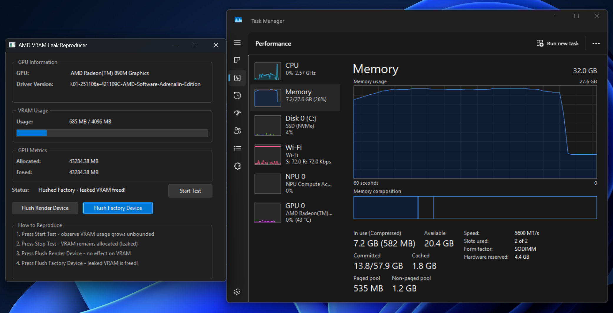

# AMD VRAM Leak Reproducer

A minimal reproduction demonstrating an unbounded memory leak leading to eventual catastrophic failure on AMD hardware.

This reproduction is based on a usage pattern present today in Chromium.

The leak does not occur when on NVIDIA or Intel hardware.



## Quick Start

**[Download the latest release](https://github.com/MeldStudio/amd-vram-leak/releases/latest/download/amd-vram-leak-repro.exe)** - single-file executable, no installation required.

### How to Reproduce the Leak

1. **Start Test** - Watch VRAM usage grow unbounded as textures are created
2. **Stop Test** - VRAM remains allocated (this is the leak!)
3. **Flush Render Device** - Has no effect on VRAM usage
4. **Flush Factory Device** - Immediately frees all leaked VRAM

The key finding: calling `Flush()` on the factory device's context releases the leaked memory.

## The Issue

When creating shared DXGI textures (`D3D11_RESOURCE_MISC_SHARED_NTHANDLE | D3D11_RESOURCE_MISC_SHARED`) and using them across D3D11 devices:

- **Expected**: GPU memory is freed when textures are released and handles are closed
- **Actual (AMD)**: Memory is never freed, VRAM climbs continuously until exhaustion

This affects applications that frequently create/destroy shared GPU resources, such as Chromium's `GpuMemoryBufferFactoryDXGI`.

There is a Factory and a Renderer. Each has a D3D11 device backed by the same hardware adapter. The Factory D3D11 device only creates textures. The Renderer uses `OpenSharedResource1` to access the texture and render something arbitrary (a solid color). A blocking CPU side wait using an `ID3D11Fence` and a waitable event ensures the Renderer's D3D11 device is done writing to the texture.

Note that the texture only exists in the `RenderToSharedTexture` scope. Once it exits this scope it will be "destroyed" and the `ID3DDestructionNotifier` callback will fire which we use to track bytes allocated and bytes freed for display in the GUI.

However – the memory backing the texture we rendered to never gets freed! On an AMD Ryzen HX 370 the integrated GPU uses unified memory (shared with system RAM, 4GB dedicated to VRAM) the dedicated GPU memory gets quickly exhausted, followed by all 32GB of System RAM, followed by a unbounded page file usage until the process eventually has a catastrophic failure.

A magical blue button "Flush Factory Device" simply calls `Flush()` on the Factory's D3D11 device and all of the leaked resources are quickly cleaned up 🪄


The leak can be avoided by calling `Flush()` on the Factory's device context after we are done rendering to the buffer. Internally this is causing the drivers deferred deletions to be processed.

```cpp
void DestroyGpuMemoryBuffer(int id, HANDLE handle) {
    CloseHandle(handle);
    
    // This fixes the leak on AMD:
    ComPtr<ID3D11DeviceContext> context;
    d3d11_device_->GetImmediateContext(&context);
    context->Flush();
}
```

## Building from Source

```powershell
# Configure and build
.\with-devenv.ps1 cmake -B out/dev -G Ninja
.\with-devenv.ps1 ninja -C out/dev

# Run
.\out\dev\repro.exe
```

## Technical Details

| Property | Value |
|----------|-------|
| Texture Size | 3840×2160 RGBA (~31.6 MB) |
| Sharing Flags | `D3D11_RESOURCE_MISC_SHARED_NTHANDLE \| D3D11_RESOURCE_MISC_SHARED` |
| GPU Sync | `ID3D11Fence` with CPU wait |

## Tested On

- AMD Radeon 890M (integrated) - **leak confirmed**
- Windows 11 with latest AMD drivers
- NVIDIA GPUs - **works correctly** (no leak)